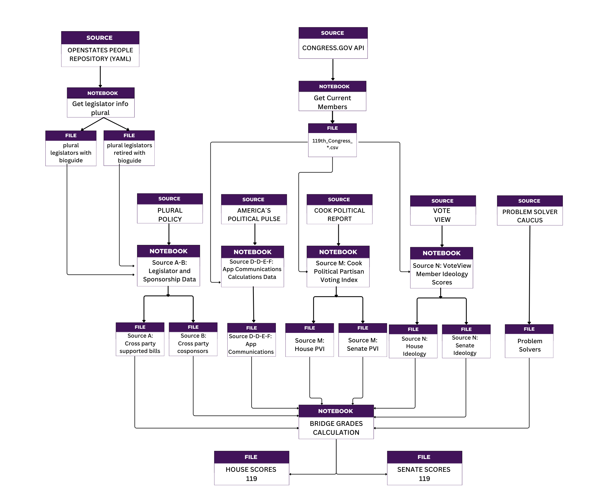

<div align="center">
  
</div>

<div align="center">

[](../../issues)

[](https://www.python.org/)


[About](#-bridge-grades-119th-u.s.-congress-bipartisan-collaboration-analysis) |
[Quickstart](#-getting-started) |
[Data Sources](#-data-sources) |
[Data Pipeline](#-data-pipeline) |
[Methodology](#-methodology-how-we-calculate-bridge-grades) |
[Repo Structure](#️-repository-structure) |
[Roadmap](#-roadmap) |
[Contribute](#-contributing)  

<br/><br/>

[🐞 Report Bug](https://github.com/BridgeGrades/119th-Congress/issues/new/choose) •
[✨ Request Feature](https://github.com/BridgeGrades/119th-Congress/issues/new/choose) •
[📖 Docs](https://zharicks.github.io/Bridge-Grades-Documentation/Intro.html)

</div>


# 🌉 Bridge Grades: 119th U.S. Congress Bipartisan Collaboration Analysis

This repository contains the data and code for the [Bridge Grades](https://www.bridgegrades.org/) project, which calculates "Bridge Grades" for members of the 119th U.S. Congress, measuring their level of bipartisan collaboration across multiple dimensions of legislative behavior and communication.

Bridge Grades provide a composite measure of bipartisan collaboration by analyzing:
- **Legislative Sponsorship Patterns** - Cross-party bill sponsorship and cosponsorship
- **Communication Analysis** - Public communications supporting opposite party members
- **District Competitiveness** - Cook Political Partisan Voting Index (PVI)
- **Ideological Positioning** - VoteView ideology scores
- **Caucus Membership** - Problem Solvers Caucus participation

Each member receives a final grade (A, B, C, F) based on their performance across these metrics.

## 🧭 Project Philosophy
Bridge Grades is built on four core principles that guide every aspect of our methodology:

- **Non-ideological:** Focus on behavior, not beliefs
- **Data-driven:** Based on observable legislative actions  
- **Transparent:** Derived from public, verifiable sources
- **Comprehensive:** Capture multiple dimensions of collaboration

These principles ensure that Bridge Grades measures **how** politicians behave rather than **what** they believe, providing objective assessments of bipartisan collaboration that transcend partisan divides.

## 📊 Data Sources

### Data Availability
> ⚠️ **Raw Data**  
> This repository does not include the raw input files gathered from external sources.  
> These sources are public, but we do not redistribute their raw files here in order to respect their licensing and usage policies.  
> To reproduce the pipeline, you must **obtain these inputs independently** and place them in the corresponding `Input files/` directories under each source folder in `Data/`.  
>  
> ℹ️ *Instructions for downloading the raw sources are provided below.*  

<div style="border-left: 4px solid #28a745; padding: 0.75em 1em; margin: 1em 0;">
  <p><strong>✅ Processed Data</strong></p>
  <p>The <strong>processed data</strong> generated by our preprocessing notebooks 
  is available in the <code>Output files/</code> directories within the same folders. 
  This means you can work directly with the processed outputs without needing to re-collect 
  or re-ingest the original raw files.</p>
</div>

### Raw Input Data
#### 1. Americas Political Pulse (APP)
The [Polarization Research Lab](https://americaspoliticalpulse.com/) captures comprehensive data on politicians' public communications, measuring them across multiple categories including Personal Attacks and Bipartisanship/Compromise.

**Data Acquisition:**
- **Website:** https://americaspoliticalpulse.com/data/
- **Access:** Select "US officials" in left menu, then "Download 2025"
- **Format:** CSV files with communication data
- **Coverage:** All forms of public communication including floor speeches, newsletters, press releases, and social media posts

**Bridge Grades Metrics:**
- **Source C:** Bipartisan Communication Sum - Total count of bipartisan communications per legislator
- **Source D:** Bipartisan Communication Percentage - Share of total communications that are bipartisan
- **Source E:** Personal Attack Sum - Total count of personal attacks per legislator
- **Source F:** Personal Attack Percentage - Share of total communications that are personal attacks

#### 2. Plural Policy Bill Sponsorship Data

[Plural Policy](https://open.pluralpolicy.com/) provides comprehensive bill sponsorship and cosponsorship data for the U.S. Congress

**Data Acquisition:**
- **Website:** https://open.pluralpolicy.com/data/session-csv/
- **Access:** Free download of session-specific CSV files
- **Format:** CSV files with bill sponsorship records
- **Coverage:** Complete bill sponsorship data for current and historical Congresses

**Bridge Grades Metrics:**
- **Source A:** Authors of Bills with Cross Party Sponsors - Count of sponsored bills with bipartisan cosponsorship
- **Source B:** Ranked People who Cosponsor Bills - Count of bills cosponsored from the opposite party

#### 3. Cook Political Partisan Voting Index (PVI)

[Cook Political Report](https://www.cookpolitical.com/) measures how partisan each congressional district and state is. 

**Data Acquisition:**
- **Website:** https://www.cookpolitical.com/cook-pvi
- **Access:** Paid subscription required
- **Format:** Excel files with district and state-level PVI data
- **Coverage:** All 435 House districts and 50 states for Senate races

**Bridge Grades Metrics:**
- **Source M:** Cook Political PVI - District/state partisan lean used as multiplier to reward

#### 4. VoteView Ideological Scores
[VoteView](https://voteview.com/) provides ideological positioning of members of Congress based on roll-call voting patterns. VoteView allows users to view every congressional roll call vote in American history on a map of the United States and on a liberal-conservative ideological map.

**Data Acquisition:**
- **Website:** https://voteview.com/data
- **Access:** Free download
- **Format:** CSV files with member ideology data
- **Coverage:** All members of Congress with ideology scores based on voting patterns

**Bridge Grades Metrics:**
- **Source N:** VoteView Member Ideology Scores - Absolute distance from ideological center used as multiplier

#### 5. Problem Solvers Caucus
[Problem Solvers Caucus](https://problemsolverscaucus.house.gov/) is a bipartisan caucus of members of Congress who are committed to finding common ground and working across party lines to solve problems.

**Data Acquisition:**
- **Website:** https://problemsolverscaucus.house.gov/caucus-members
- **Coverage:** All members of Congress who are members of the Problem Solvers Caucus

**Bridge Grades Metrics:**
- **Source P:** Problem Solvers Caucus Membership - Bonus for members of the Problem Solvers Caucus

#### 6. Current Legislators
To keep track of **current members of Congress**, we query the official [Congress.gov](https://www.congress.gov/) API. 

**Data Acquisition:**  
- **API Endpoint:** `https://api.congress.gov/v3/member/congress/119/`  
- **Access:** Requires a personal API key. You can request one at [Congress.gov API sign-up](https://api.congress.gov/sign-up/).
- **Notebook:** `Data/Current_Legislators/get_current_members.ipynb`  
- **Output File:** A CSV file (`119th_Congress_{date}.csv`) with current members of Congress. 

#### 6. Current and Retired Legislator IDs Across Different Sources 
To maintain a consistent mapping of legislators across datasets, we collect **current and retired legislator identifiers** from [Open States](https://github.com/openstates/people) enabling us to link them to the **Bioguide ID** (the standard identifier used by Congress.gov and other sources).  

**Data Acquisition:**  
- **Repository:** [openstates/people](https://github.com/openstates/people)  
- **Requirement:** You must clone this repository locally to access the YAML files.
- **Data Format:** YAML files containing biographical and identifier information for legislators.
- **Output File:** A CSV file (`plural_legislators_with_bioguide.csv`) containing Bioguide IDs, Plural Policy IDs, and additional identifiers.  
  
## 🔄 Data Pipeline

The Bridge Grades methodology follows a systematic data pipeline that transforms raw congressional data into meaningful collaboration grades.

<div align="center">
  
  <p><em>Bridge Grades Data Processing Pipeline</em></p>
</div>

### Stage 1: Data Preprocessing Notebooks
Transforms raw data sources into standardized, analysis-ready datasets. Each preprocessing notebook takes one or more raw data sources and converts them into the specific metrics needed for Bridge Grade calculations. These notebooks handle data cleaning, standardization, and initial metric calculations.

### Stage 2: Data Integration and Scoring
Combine all processed datasets and calculate final Bridge Grades. The main scoring engine takes all preprocessed datasets and applies the Bridge Grades algorithm to generate final letter grades (A, B, C, F) for each member of Congress.

Final datasets include complete scoring breakdowns, allowing users to understand exactly how each Bridge Grade was calculated.

```
Raw Data Sources
       ↓
┌─────────────────────────────────────┐
│    Data Preprocessing Notebooks     │
│                                     │
│  Source A-B: Bill Sponsorship       │
│  Source C-D-E-F: Communications     │
│  Source G-H: Voting Patterns        │
│  Source M: District PVI             │
│  Source N: Ideology Scores          │
└─────────────────────────────────────┘
       ↓
┌─────────────────────────────────────┐
│    Bridge_Grades_119 Calculation    │
│                                     │
│  1. Attendance Filtering            │
│  2. Data Integration                │
│  3. Normalization                   │
│  4. Weighted Scoring                │
│  5. Grade Assignment                │
└─────────────────────────────────────┘
       ↓
┌─────────────────────────────────────┐
│        Final Outputs                │
│                                     │
│  house_scores                       │
│  senate_scores                      │
└─────────────────────────────────────┘
```

## 🧮 Methodology: How we calculate Bridge Grades
1️⃣ **Aggregate** datasets from multiple public sources for each member of Congress on their legislative records and rhetoric.

2️⃣ **Normalize** datasets to a 0-100 range.

3️⃣ Apply **weights** to each normalized dataset (what you do counts more than what you say).

4️⃣ **Sum** the totals of the weighted scores.

5️⃣ Apply degree-of-difficulty based courage **bonuses** to reward bridging by those with wide ideologies and who represent hard leaning partisan districts.

6️⃣ (House only) Add bonus for members of the bipartisan Problem Solvers Caucus.

7️⃣ **Normalize** the final totals into a 0-100 scale (the Bridge Score)

8️⃣ Apply a forced grading **curve** and assign Bridge Grades for each member. The top 50% (bridgers) earn As and Bs, while the bottom half (dividers) earn Cs and Fs. One standard deviation away from the mean are As and Fs.

### 🧱Scoring Components

**Core Sources (A-F)**
- **Source A** (Weight: 3): Number of bills authored with cross-party cosponsors
- **Source B** (Weight: 2): Number of cross-party bills cosponsored
- **Source C** (Weight: 1): Communications supporting opposite party members (count)
- **Source D** (Weight: 1): Proportion of communications supporting opposite party
- **Source E** (Weight: 1): Personal attack communications (count, inverse scoring)
- **Source F** (Weight: 1): Proportion of personal attack communications (inverse scoring)

#### Bonus Sources (M, N, P)
- **Source M**: Cook PVI bonus for competitive districts (capped at 15 points)
- **Source N**: Ideology bonus for moderate positioning
- **Source P**: Problem Solvers Caucus membership bonus

### ⚙️ Configuration

Key parameters can be modified in the main calculation notebook:

```python
# Scoring weights
weights = {
    'A': 3,   # Cross-party bill authorship
    'B': 2,   # Cross-party cosponsorship  
    'C': 1,   # Bipartisan communications (count)
    'D': 1,   # Bipartisan communications (proportion)
    'E': 1,   # Personal attacks (count, inverse)
    'F': 1,   # Personal attacks (proportion, inverse)
}

# Bonus scaling factors
bonuses = {
    'pvi_value_cap': 15,                    # PVI cap
    'max_P_bonus_scaling_factor': 0.01,     # PSC bonus
    'max_N_bonus_scaling_factor': 0.05,     # Ideology bonus
    'max_M_bonus_scaling_factor': 0.38      # PVI bonus
}

# Minimum attendance threshold
att_pct = 0.2  # 20%
```

## 🗂️ Repository Structure

```
119th-Congress/
├── Bridge_Grades_Calculation/         # Final scoring and grade calculation
│   ├── Bridge_Grades_Calculation.ipynb    # Main calculation notebook
│   └── *.xlsx                             # Output score files
├── Data/                              # Processed data by source
│   ├── Current_Legislators/               # Master legislator roster
│   ├── Source A-B/                        # Sponsorship data (Input/Output)
│   ├── Source C-D-E-F/                    # Communication data (Input/Output)
│   ├── Source M/                          # PVI data (Input/Output)
│   ├── Source N/                          # Ideology data (Input/Output)
│   └── Source P/                          # Problem Solvers Caucus data
├── Sources/                           # Data preprocessing notebooks
│   ├── Source A - B_ Legislator and Sponsorship Data.ipynb
│   ├── Source C - D - E - F_ App_Communications_Calculations.ipynb
│   ├── Source M House_ House & Senate Cook Political PVI.ipynb
│   └── Source N_ VoteView Member Ideology Scores.ipynb
└── README.md                          # This file
```

## 🚀 Getting Started

### Prerequisites
- Python 3.8+
- Jupyter Notebook
- Required packages: `pandas`, `numpy`, `scipy`, `matplotlib`, `seaborn`, `rapidfuzz`, `tqdm`, `plotly`, `pyyaml`

### Installation
```bash
git clone https://github.com/BridgeGrades/119th-Congress.git
cd 119th-Congress
pip install -r requirements.txt  # If available
```

### Running the Analysis

1. **Data Preprocessing** (Optional - data already processed):
   ```bash
   # Run source notebooks:
   jupyter notebook "Data/Current_Legislators/get_current_members.ipynb"
   jupyter notebook "Data/Current_Legislators/get_legislator_info_plural.ipynb"
   jupyter notebook "Sources/Source A - B_ Legislator and Sponsorship Data.ipynb"
   jupyter notebook "Sources/Source C - D - E - F_ App_Communications_Calculations.ipynb"
   jupyter notebook "Sources/Source M House_ House & Senate Cook Political PVI.ipynb"
   jupyter notebook "Sources/Source N_ VoteView Member Ideology Scores.ipynb"
   ```

2. **Final Grade Calculation**:
   ```bash
   jupyter notebook "Bridge_Grades_Calculation/Bridge_Grades_Calculation.ipynb"
   ```

### Output Files
The main calculation notebook generates several Excel files:
- `house_scores_119_[date].xlsx` - House member scores
- `senate_scores_119_[date].xlsx` - Senate member scores  
- `congress_scores_119_separate_sheets_[date].xlsx` - Combined with separate sheets
- `congress_scores_119_single_sheet_[date].xlsx` - All data in single sheet

## 🚀 Roadmap  

We are continuously improving this repository. At the moment, the workflows are primarily implemented as Jupyter notebooks.  
Our planned improvements include:  

- 🔄 Migrating notebook workflows into Python scripts for easier automation and reproducibility.  
- 📅 Developing an automated pipeline that will update the data on a **monthly** schedule.  
- 🏗️ General refactoring and cleanup to support more robust, production-ready usage.  

These updates will streamline the process and reduce the need for manual execution of notebooks.

## 🤝 Contributing  

Contributions are welcome! 🎉  

If you’d like to get involved, the easiest way is to **open an issue** in this repository, or get in touch at [https://www.bridgegrades.org/support](https://www.bridgegrades.org/support).
  
We especially encourage contributions in the following areas:  

- 🧮 **Methodology:** Suggest improvements to how Bridge Grades are calculated.  
- 📊 **Data Sources:** Propose additional or alternative data sources that could strengthen the analysis.  
- 💡 **General Feedback:** Share ideas for documentation, automation, or other improvements.  

To open an issue, head to the [Issues tab](../../issues) and describe your suggestion.  

We’ll review all submissions and discuss next steps.  


---

*Last updated: August 2025*
*Data current through: 119th U.S. Congress (August 2025)*
